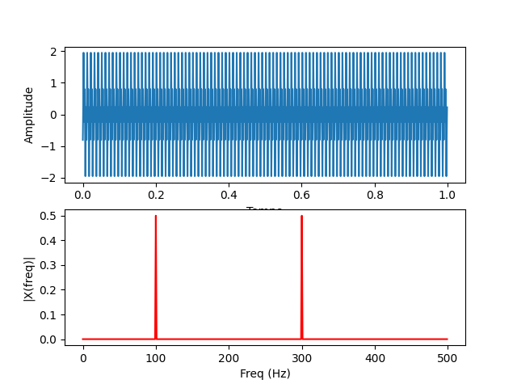

# Discrete Fourier Transform (DFT) From Scratch

A from-scratch Python implementation of the Discrete Fourier Transform (DFT). This repository explores the underlying mathematics of digital signal processing by manually computing Euler's formula and complex magnitudes, coding the exact logic behind standard library functions like `np.fft.fft` and `abs()`.

### About the Project
This is an academic project built for a Digital Signal Processing (DSP) class, aiming to provide a deeper understanding of the Fast Fourier Transform (FFT), its applicability, and its mathematical foundation.

### The Math Behind It
In this code, we have two superimposed signals generated in the time domain, and we want to analyze them in the frequency domain. To do this, we apply the DFT concept. For every frequency bin, we calculate its mathematical representation and normalize it:

$$X[k] = \frac{1}{N} \sum_{n=0}^{N-1} x[n] \left( \cos\left(\frac{2\pi}{N} k n\right) - j\sin\left(\frac{2\pi}{N} k n\right) \right)$$

This calculation yields a complex number composed of a real and an imaginary part. To plot this data on a frequency spectrum graph, we need the actual magnitude of this number, which is calculated using the Pythagorean theorem:

$$|X[k]| = \sqrt{\text{Re}(X[k])^2 + \text{Im}(X[k])^2}$$

By iterating through every frequency, we calculate the DFT modulus manually and plot the final results.

### Time Complexity
To iterate through every frequency and every sample of the signal, we used two nested `for` loops. Taking that into consideration, our manual implementation has a time complexity of $O(N^2)$. 

On the other hand, if we had used the optimized `np.fft.fft` algorithm, the time complexity would drop significantly to $O(N \log N)$.

### How to Run
To run this code, you will need to install the following Python libraries:
* `numpy`
* `matplotlib`

### Results

